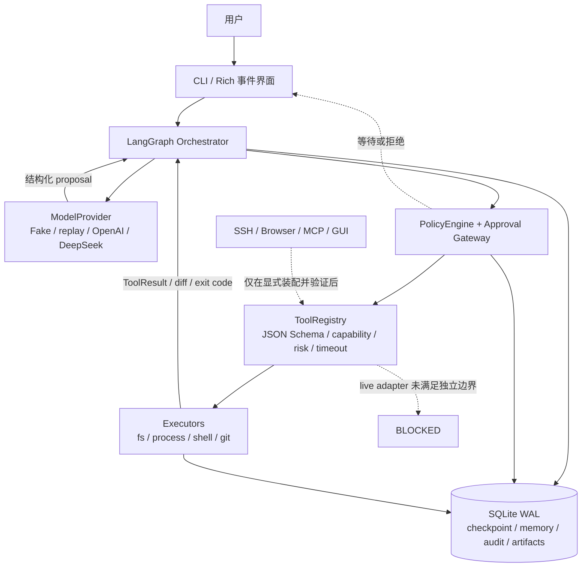
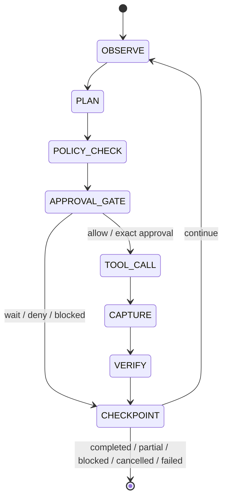

# AsterCode 架构

本文记录当前可运行实现，而不是把计划中的 live 集成写成已完成能力。AsterCode 是 local-first 的 LangGraph 编程代理：模型提出结构化建议，宿主运行时负责验证、审批、执行、记录和恢复。

## 运行时分层

实线表示当前本地垂直链路中由运行时执行或持久化的控制/数据流。虚线表示不会被提示词或普通审批绕过的边界：动作可能暂停、拒绝，或者因为 SSH、浏览器、插件、GUI 缺少独立的 OS/网络证明而保持 `BLOCKED`。模型从不直接持有 executor；它只能返回受 schema 约束的 proposal。

Orchestrator 的一轮状态转换为：

### CLI 层

所有公共入口（`aster`、`astercode`、`python -m astercode.cli`）都启用严格模式：启动目录是唯一授权根，宽根/系统树/UNC 被拒绝，项目文件不能开启 live Provider、SSH、网络、浏览器、插件、GUI 或外部状态路径；live 模型只接受用户环境的显式选择。

入口在 `astercode.cli`；兼容命令为 `astercode`，快捷入口 `aster` 在无参数时注入 `chat`，有参数时保留完整命令面。命令包括 `init`、`doctor`、`run`、`chat`、`resume`、`status`、`kill`、`sessions`、`memory`、`config`、`permissions`、`audit` 和 `ssh hosts`。快捷对话最终把规范化启动目录绑定为唯一授权根，并在宿主终端内收集精确审批；普通对话文本不构成批准。新项目使用 `astercode.toml`，旧版 AsterCode `config.toml` 仅在识别到版本和产品字段时兼容，避免误读其他应用的通用配置。`config migrate` 默认只预览 `config_version=1` 规范化结果，只有 `--write` 才会在精确备份和并发冲突检查后原子替换源文件；旧格式由测试 fixture 覆盖，被 Git 忽略的机器本地配置不属于源码交接物。CLI 不直接拼接或执行模型给出的 shell；所有动作经过 registry、policy 和 gateway。

`run --stream` 将 provider delta、工具生命周期和完成事件打印为经过脱敏的事件。`--replay` 只读取授权根目录内的 JSON 数组 fixture，禁止疑似秘密和过大输入。run 的默认预算是 40 rounds、100 tool calls、120,000 total tokens、100,000 input tokens、20,000 output tokens 和 3,600 秒；`--max-rounds`、`--max-tool-calls`、`--max-tokens`、`--max-input-tokens`、`--max-output-tokens`、`--max-elapsed-seconds` 可以只覆盖当前 run。

### Orchestrator 层

`AsterCodeOrchestrator` 使用显式 LangGraph `StateGraph`。状态包含目标、假设、计划、完成项、待办项、活动文件、测试状态、风险、审批、阻塞、预算和下一步。每一轮受最大轮数、工具调用数、token、费用、耗时和并发预算约束。工具前后保存产品 checkpoint；LangGraph 另有异步 SQLite checkpointer 用于图状态。

结果状态为 `completed`、`partial`、`blocked`、`cancelled` 或 `failed`。超时、取消或进程崩溃不能被当成成功；有副作用而无法确认时为 `unknown`，恢复必须先只读 reconcile。

Provider in-flight 时，持久化 session 和 `status` 查询保持 `running`，终态收敛不会遗留运行中状态；该生命周期同步问题已通过回归测试修复。

### Provider 边界

`ModelProvider` 只返回严格 Pydantic 结构：计划、消息、工具 proposal 和 outcome。`ToolProposal` 会拒绝疑似秘密，且模型没有执行器引用。

- `DeterministicFakeProvider`：默认离线测试模型。
- replay provider：从授权 fixture 重放确定性决策。
- `OpenAIAgentsProvider`：对当前安装的 OpenAI Agents SDK/Responses API 的适配层，读取配置中的 model ID 和环境变量名；当前没有真实凭据 smoke test。
- `DeepSeekChatProvider`：使用 OpenAI Python 客户端调用 DeepSeek 官方 Chat Completions。Provider 名为 `deepseek`，key 引用默认为 `DEEPSEEK_API_KEY`，模型从配置或 `ASTERCODE_MODEL_ID` 读取；官方根地址固定为 `https://api.deepseek.com`，不能改到仓库控制的代理、`/anthropic` 或其他主机。请求使用 `response_format={"type":"json_object"}`，返回值先解析为严格的 Provider decision，再交给宿主 policy/gateway。DeepSeek 流式 `reasoning_content` 被丢弃；`content` 会先完整通过 JSON、秘密、usage 和唯一终止状态校验，再转发已验证的 delta，避免跨 SSE 分块泄密。接口依据见 DeepSeek 官方[首次调用 API](https://api-docs.deepseek.com/zh-cn/)与[Chat Completions API](https://api-docs.deepseek.com/api/create-chat-completion)。2026-08-23 已有三次真实只读 smoke：第一次 8 轮/12 次只读工具/148,994 tokens/约 4 分 28 秒，后两次窄范围任务分别为 13,636 和 13,761 tokens、均为 2 轮/1 次 `fs.read`/约 12 秒；负载不同，不能当作性能 A/B 或完整 live 能力验证，成本尚未核对。

Provider 的 token 使用量进入预算和事件；成本只有 provider 明确返回时才记录，不虚构成本。SDK tracing 默认关闭。Provider 凭据不交叉使用：OpenAI 与 DeepSeek 分别读取自己的环境变量引用；Claude Code 的 `ANTHROPIC_*` 变量和 `[1m]` 模型别名不属于 AsterCode 的 DeepSeek Chat 契约。

OpenAI client 固定 `https://api.openai.com/v1`，DeepSeek client 固定 `https://api.deepseek.com`；两者的 HTTP transport 都使用 `trust_env=false`，不会从环境代理或 `OPENAI_BASE_URL` 改写路线。每次请求的 timeout 是 run 剩余时长，输出上限取剩余 total/output token 的更小值，终态再校验 Provider 报告的 usage。输入 token 只有响应后才能可靠计数，因此是事后预算核对；费用上限在 Provider 不支持可靠 cost tracking 时调用前 fail-closed。

现场 smoke 的运行数据曾显示：简单只读任务出现了较高的重复上下文和过细的流式审计分片（148,994 tokens、约 4 分 28 秒）。随后已完成 delta batching、context compaction 和审计镜像一致性修复；该历史数字仍不是性能基线或成本承诺。

## Tool Registry 与 Gateway

每个工具声明名称、JSON Schema、capability、真实副作用、风险级别、超时、最大输出和幂等性。`ToolRegistry` 只暴露注册工具；`LocalToolGateway` 在执行前重新规范化参数、计算 action hash、查询 `PolicyEngine`，在执行后保存结果和 checkpoint。MCP/Plugin 扩展的输入 schema 使用 Draft 2020-12 validator 严格校验；只允许文档内 `$ref`/`$dynamicRef`，拒绝远程引用，并对 schema 深度和节点数设上限。扩展 manifest 的 read-only/risk 仅是声明，实际参数会重新分类：`recursive=true`/`force=true` 等递归或强制动作进入 P4，命令、上传、发布和外部写入至少 P3。

统一 `ToolResult` 至少包含 call/action id、工具、主机、cwd、起止时间、状态、退出码、stdout、stderr、artifacts、truncated、side_effects 和 error。每次工具 timeout 取 tool spec、参数和 run 剩余时长中的最小值。大输出截断并保存在授权 artifact 目录，进入模型和审计前统一脱敏；若 capture 已因保留上限丢弃后缀，artifact 元数据会写 `source_complete=false`、丢弃量和 incomplete marker，未保留后缀不会落盘。artifact 磁盘预算截断以独立 `disk_complete=false` 标记。

## 当前 executor 状态

### 已可离线验证

- 文件：`fs.list/stat/read/search/apply_patch/mkdir/move/delete`。路径 canonicalize、根目录 allowlist、symlink 防逃逸、TOCTOU 身份复核、原子替换和精确 patch 已实现。
- 进程：`process.exec/shell.exec/start/poll/send_input/stop`。默认结构化 argv、干净环境、不载入 profile/.env/Git hook。Windows 目标以 `CREATE_SUSPENDED` 创建，先加入 Job Object 再恢复，Job 启用 `KILL_ON_JOB_CLOSE`、树级 active-process、job-memory 和累计 user-mode CPU-time limit；POSIX 使用 process group。每次启动有唯一 `proc_...` 句柄，双流后台 capture 持续排空并有界保留。进程 registry 持久化 handle、PID、身份 token 和 argv hash，支持跨进程 kill/reconcile 记录。本机已通过父子树 Job close/`process.stop`、进程数/内存/CPU 限额和 assignment-failure marker 测试；Job Object 只提供树级生命周期/资源约束，不提供文件或网络隔离。
- Git：status/diff/log/show/branch/commit/push 包装；P0 查询拒绝 include、filter/diff/merge 外部驱动、hooks、fsmonitor、外部 attributes/excludes 文件，使用 `GIT_NO_LAZY_FETCH=1` 阻止 partial/promisor clone 隐式取对象，并为 diff/show 禁用 external diff/textconv。危险动作按 P3/P4 处理，未验证网络时 push fail-closed。
- Fake SSH：内存 transport 覆盖 host-key 校验、exec/start/poll/stop、上传/下载/stat/close、SHA-256、超时 unknown 和 host key 变化。它是测试适配器，不是真实网络连接。真实审批的规范化 `ssh_target` 同时绑定配置 hostname/port/user/指纹、known_hosts 真实路径和文件 SHA-256；`ssh.start` 只确认远程句柄创建，不确认命令完成。`stop_all` 只返回明确确认停止的句柄；`close` 或 stop 无法确认时保留句柄并返回 `unknown`，供只读 reconcile。
- Fake Browser：隔离的内存 fixture、域名和重定向 allowlist、DNS/私网/metadata 检查、受控下载和表单模拟；不打开 socket。
- Playwright Edge：可选依赖，使用非持久化 `BrowserContext`，禁用 JavaScript、下载、权限和 Service Worker，并对每个 HTTP(S) 请求与重定向复核 allowlist 和解析地址。路由检查不能消除 DNS 解析/连接竞态，所以只有宿主注入 `verified_browser_network_policy` 时才允许导航；默认 CLI 不注入。本机只验证 `about:blank` 启动且页面网络请求为 0。
- 系统 OpenSSH：真实命令通道使用受信系统绝对路径、结构化 argv、干净环境和专用 strict `known_hosts`；配置 SHA-256 指纹必须从唯一精确 host:port 公钥推导一致。只有配置启用、非空 allowlist 和宿主注入 `verified_ssh_network_policy` 三者同时满足才装配。当前没有这样的 OS egress 证明，且 SFTP/stat/远程原子写硬关闭，因此没有连接真实主机。
- Fake MCP/Plugin：精确 source/version/hash/capability pin，deterministic runner 通过 policy gateway 调用；runner 不是进程隔离边界。
- 只读子代理：必须同时启用 feature 与 security 开关；权限是父代理 capability、根目录和预算的交集。并发 child 使用原子 reservation 预扣父预算，发起 delegation 前刷新父实时 usage，child 终态 usage 合并回 parent；跨重启无法确认结算的 reservation 按完整额度恢复扣减。runner 支持按 grant、parent session 或全部任务定向取消并等待子任务清理。当前 offline child 与父代理同进程，live Provider delegation 和生产隔离保持 blocked。

### Live 或 OS 边界仍未验证

- OpenAI 真实 API 调用、真实 streaming 质量和账户模型可用性。
- DeepSeek 的完整 live 能力、账户模型覆盖和真实 streaming 质量；目前有三次 `deepseek-v4-flash` 只读 smoke，以及可复现的同会话两轮文件创建/修改/删除 smoke。最终提交 `904cc6e` 上的写入 session `session_49c2fb8db498411880b8680b38bb89da` 包含 7 个用户 turn、6 次单次审批和 6 次副作用调用（4 次 `fs.apply_patch`、2 次 `fs.delete`），覆盖了逐步内容核对、精确审批、文件副作用和审计，但没有覆盖 Shell、长任务、成本核对或远程操作。
- SSH egress allowlist 的 OS 证明、首次指纹登记、真实主机/认证/MFA、SFTP、远程 PID、备份/原子替换/回滚。
- 浏览器 OS egress 防 SSRF、真实外网导航、下载、提交和登录态工作流；Playwright + Edge 目前只完成无网络引擎 smoke。
- 原生桌面 GUI（默认关闭）。
- MCP/plugin 的真实隔离子进程、来源下载和网络策略。
- Docker 临时构建沙箱已完成 Windows 11 + Docker Desktop 及 WSL2 Ubuntu 测试切片：固定 RepoDigest、只读 root/宿主源码、隐藏状态/VCS/本机依赖、512 MiB 可写 tmpfs 副本、`--network none`、非 root、模型命令 capabilities 全为零、no-new-privileges、PID/memory/CPU/tmpfs 限额，并由主动 probe attestation。固定复制器使用逐项 Python 复制与 `os.execvp`，模型 argv 不进入 shell；执行前对源目录复制前后及临时副本做文件类型/链接目标/SHA-256 清单比对，变化或特殊文件会 fail-closed。普通构建产物随容器删除。
- Docker process registry 保存容器名、AsterCode 标签和镜像 ID；跨执行器清理会重新 inspect 三项身份后才 `rm --force`，并现场验证不会只终止宿主 Docker CLI 而遗留容器。
- `process.exec_export` 使用单独的受信包装器：包装器只在复制只读源码快照、调整临时副本属主和降权时持有 `DAC_READ_SEARCH/CHOWN/SETUID/SETGID`，模型命令启动前再次核对 effective/permitted/inheritable/ambient capabilities 全为零。构建用户不能写 root-only 导出区；成功后包装器才把精确列出的普通文件复制到 Docker 管理的匿名卷。容器停止后，宿主通过 `docker cp ... -` 接收 tar 流，自行拒绝越界路径、链接、设备、重复/额外条目和超限内容，计算 SHA-256 后原子发布到 `.astercode/artifacts/build_*`。
- AppContainer、Windows Sandbox/Hyper-V、镜像签名/SBOM/扫描和跨进程 Windows Job handle/POSIX 恢复仍未验证。
- WSL2 Ubuntu 2 已用独立 Python 3.12 venv 完成全量测试，包含真实 Docker/bash 的执行、无网络、超时/停止、恢复身份和受控产物导出；该证据适用于 WSL + Docker Desktop Linux engine，不外推到裸机 Linux或独立生产 daemon。
- Windows 普通文件/目录 symlink、真实 junction/reparse、真实 Ctrl-Break，以及宿主帮助进程异常退出触发 Job `KILL_ON_JOB_CLOSE` 均已在开启开发者模式的当前主机回归。
- `doctor` 通过固定安装路径探测 `cosign`、`syft`、`trivy`，缺失时显示 `NOT VERIFIED`；镜像 digest 固定不等于签名、SBOM 或漏洞扫描通过。

这些能力没有 verified adapter 时必须保持 `blocked` 或 `LIVE INTEGRATION NOT VERIFIED`，不能仅靠 prompt 放行。

## Policy 与审批

风险分类由真实动作重判，而不是相信工具或插件自报标签：

| 级别 | 典型动作 | 默认行为 |
| --- | --- | --- |
| P0 | 工作区读取、Git 只读 | allow |
| P1 | 工作区内可逆写入 | 记录 diff；常规 CLI 需审批，可在测试中显式 auto-approve |
| P2 | 安装、网络、长期进程、未沙箱执行 | 精确审批；审批不能替代沙箱/网络强制边界，未验证时仍 blocked |
| P3 | 远程写、push、部署、sudo、外部提交 | 即时逐项审批 |
| P4 | 递归删除、强推、生产/IAM/磁盘动作 | 默认 deny |

通用 `process.exec`/`process.start`/`shell.exec` 不是逃生舱：策略检查程序名、解释器内联代码、wrapper 和 shell 文本，尝试绕过专用 Git、SSH、network/external-service、delete 或机器控制工具的动作直接按 P4 拒绝。当前 Docker adapter 只有在实际 probe 通过后才为 process policy 提供 sandbox/network attestation；配置字段和审批本身都不能提供证明。

审批持久化 `approval_id`、`action_id`、规范化动作 hash、cwd、真实路径、diff hash、主机指纹、过期时间和一次性 nonce。对于 SSH，动作 hash 的 `ssh_target` 还包含配置中的 hostname、port、user、配置指纹、known_hosts 规范化真实路径和当前文件 SHA-256；主机配置或信任文件任一变化都会使旧审批失效。消费、拒绝、撤销和跨进程恢复均校验绑定值。参数、路径、主机或 diff 变化会让旧审批失效。会话级授权只允许 P1/P2，并继续精确绑定同一 session 与动作 hash；P3/P4 不可获得会话级授权。

## Storage、memory 与 audit

`Storage` 使用 SQLite WAL、busy timeout、跨进程迁移锁和显式 migrations，当前 `SCHEMA_VERSION = 8`：

1. 基础 sessions/turns/messages/events/checkpoints/tool_calls/approvals/artifacts/memory/audit/runtime_flags。
2. `ssh_hosts`。
3. `memory_proposals`（create/edit）。
4. memory supersedes/conflict 字段。
5. `runtime_processes`。
6. process identity token 和 argv hash。
7. `approval_grants`，用于与 session、动作哈希和到期时间精确绑定的窄范围授权。

升级有事务性备份；数据库和 JSONL audit 都保存哈希链。每次 `Storage.initialize()` 在任何写连接、迁移锁或 DDL 之前先以只读连接做 schema preflight，并在锁内再次复核。future schema、非连续/gap migration history、伪造版本记录、关键表或列缺失，或 `memory_fts` 不是 FTS5 虚表时，初始化会 fail-closed 且不改变数据库。`astercode audit verify` 只读验证链和 SQLite 一致性，不宣称能防止拥有数据库文件权限的外部管理员篡改。2026-08-23 的 DeepSeek smoke 结束后曾发现 JSONL/SQLite 少一条记录；随后执行 `uv run astercode audit repair --root . --confirm` 追加 1 条 `audit.mirror_repaired`，当时实测 `audit verify` 返回 `valid=true, entries=2693`。旧开发电脑后来又核对为 `entries=2741`（当时 head `a4436347...`）；这些记录不会迁移到 clean clone，也不是固定基线。该历史一致性缺陷已修复并回归，但这不改变管理员级审计防篡改和其他外部边界仍未验证的结论。

记忆分三层：

- 短期：当前图状态和工具结果。
- 中期：session、turn、checkpoint、审批、测试状态和恢复信息。
- 长期：`memory_entries` + FTS5，带 namespace、source、confidence、TTL、tags、sensitivity、supersedes。写入必须 propose → commit；edit 会保留元数据并创建 superseding entry，陈旧 edit 进入 conflict，不静默覆盖。

长期记忆以渐进式摘要注入当前任务，不能改变 policy 或授权能力。

## 取消、恢复与并发

本地进程启动后立即写入 `runtime_processes`，包含 PID identity token；Docker 进程还保存 backend、容器名和镜像 ID。同一进程的取消和 CLI `kill` 会先验证 PID；Docker 则额外验证固定格式容器名、AsterCode 所有权标签和镜像 ID 后才删除。Windows 已现场验证跨执行器容器清理；Job Object 会在恢复目标代码前完成分配，并在 stop、handle close 或宿主帮助进程异常退出时终止其父子树。POSIX `/proc` 的 zombie 会视为已终止而非可恢复活进程。跨重启 Job handle 转移、POSIX 进程组强制回收和远程进程树仍未完成现场矩阵。

工作区写入使用 workspace lock；SQLite 连接使用 WAL 和 busy timeout。跨 session 的状态、审批和 memory 通过 session ID、workspace 和持久化绑定隔离。

## 真实集成启用原则

任何 live adapter 都必须先有独立的 OS/网络/凭据验证、最小 allowlist 和即时审批。运行时装配把 `verified_process_sandbox` 与 `verified_process_network_policy` 作为 attested adapter 的依赖注入点；正常生产 CLI 两者均保持 false，deterministic 测试可以显式注入 true 以测试执行链路。此前 `deny_by_default` 下 `allow_unsandboxed` 审批可能越过未验证网络边界的问题已经修复：现在进程沙箱和网络策略任一缺少验证，process/shell 都在 spawn 前 fail-closed。没有这些证据时，配置字段和审批只表达意图，不能放行执行。
